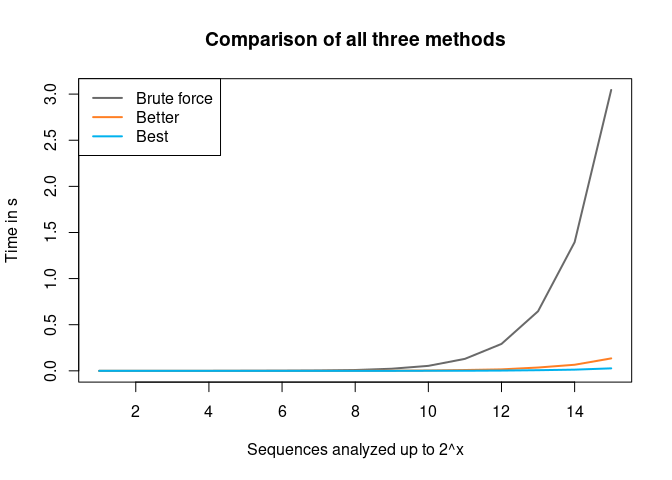
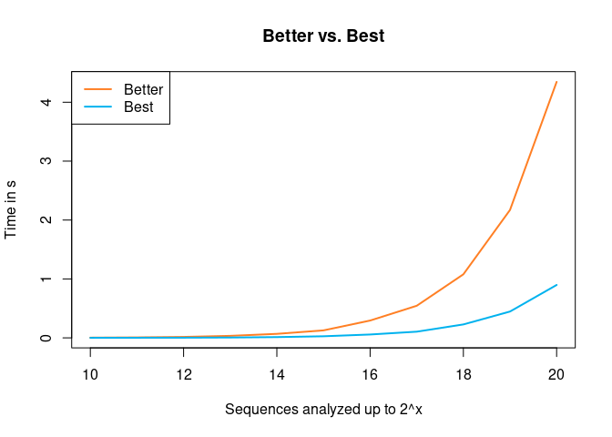

Problem 14: Longest Collatz sequence
================
Martin Stefan
2023-03-13

### The problem

The following iterative sequence is defined for the set of positive
integers:

$$
n → ~ n/2 ~~~~~~ (n ~ \text{is even})
$$ $$
n → ~ 3n + 1 ~~~ (n ~ \text{is odd})
$$

Using the rule above and starting with 13, we generate the following
sequence:

$$
13 → 40 → 20 → 10 → 5 → 16 → 8 → 4 → 2 → 1
$$

It can be seen that this sequence (starting at 13 and finishing at 1)
contains 10 terms. Although it has not been proved yet (Collatz
Problem), it is thought that all starting numbers finish at 1.

Which starting number, under one million, produces the longest chain?

NOTE: Once the chain starts the terms are allowed to go above one
million.

## Preliminaries

Let’s begin by writing a simple function which can generates the next
value of a Collatz sequence:

``` r
collatz <- function(n) {
  if (n %% 2 == 0) {
    return(n/2)
  } else {
    return(3*n+1)
  }
}
```

Here is how it works in action:

``` r
n <- 13
while (n > 1) {
  print(n)
  n <- collatz(n)
}
```

    [1] 13
    [1] 40
    [1] 20
    [1] 10
    [1] 5
    [1] 16
    [1] 8
    [1] 4
    [1] 2

Notice that we only generate new values while `n > 1`. Otherwise, we
would get stuck in the cycle \$1 → 4 → 2 → 1 →\$. Let’s wrap our loop in
a function that can generate the entire Collatz sequence for a given
starting number:

``` r
collatz_sequence <- function(n) {
  numbers <- c(n)
  while (n > 1) {
    n <- collatz(n)
    numbers <- c(numbers, n)
  }
  return(numbers)
}
```

Here are a few sequences:

``` r
collatz_sequence(1)
```

    [1] 1

``` r
collatz_sequence(5)
```

    [1]  5 16  8  4  2  1

``` r
collatz_sequence(10)
```

    [1] 10  5 16  8  4  2  1

## Brute force

At this stage, we could try to brute-force the problem. I am going to do
this for starting values up to 1000:

``` r
brute_force <- function(x) {
  max_number <- NULL
  max_length <- 0
  for (i in 1:x) {
    numbers <- collatz_sequence(i)
    if (length(numbers) > max_length) {
      max_length <- length(numbers)
      max_number <- i
    }
  }
  return(max_number)
}

brute_force(1000)
```

    [1] 871

As we can see, among all starting numbers up to 1000, 871 produces the
longest Collatz sequence. However, when running this brute-force
approach for starting numbers up to 1,000,000, our computer may
struggle.

## Optimization

Let’s head back to the start and have a look at the following two
sequences:

``` r
collatz_sequence(5)
```

    [1]  5 16  8  4  2  1

``` r
collatz_sequence(6)
```

    [1]  6  3 10  5 16  8  4  2  1

Notice how the last six values of `collatz_sequence(6)` (i.e., 5, 16, 8,
4, 2, 1) are the same as the sequence generated by
`collatz_sequence(5)`. So when generating `collatz_sequence(6)`, we
could have just stopped at “5”, because we had already established what
comes after it. In fact, if we had run `collatz_sequence(3)` before, we
could have even stopped at “3”.

This implies that when generating sequences with consecutive starting
values, we can always stop within a sequence, once we encounter a value
which was the starting value of a previous sequence.

``` r
better_solution <- function(x) {

  # create vector in which to store the sequence lengths
  lengths <- rep(0, x)
  
  # generate sequences for different starting values
  for (start in seq(lengths)) {
    
    # setup for a new sequence
    n <- start
    count <- 0
    
    # generate new value as long as:
    #   n > 1: we have not reached the end of the sequence
    #   n >= start: we have not arrived at a previous starting value
    while (n > 1 & n >= start) {
      n <- collatz(n)     # update n
      count <- count + 1  # update the length count  
    }
  
    # add the length of the sequence at whose starting value 
    # we just stopped generating new values in the current sequence
    count <- count + lengths[n]
    
    # store the count in our vector of sequence lengths
    lengths[start] <- count
    
  }
  
  # which starting value produced the longest sequence?
  return(which.max(lengths))

}

better_solution(999999)
```

    [1] 837799

## Further improvements

However, we can improve our code even further. Notice that the Collatz
sequence starting at 1 million has 500,000 as its next value and that
the Collatz sequence starting at 999,998 hast 499,999 as its next value.
This means, that all sequences with starting values less or equal to
500,000 are really just subsets of the series with starting values
greater than 500,000. Therefore, we can start our search at 500,000
instead of 1. Notice also, that after every even number `n` we move
closer to zero, because `n` is followed by `n/2`. Conversely, every odd
number `n` leads to a greater number `3n+1`. This means that no sequence
stops after an odd number. So when faced with an odd number, instead of
first computing `3n+1` and in the step after that `(3n+1)/2`, we can
skip the first step and compute the latter result right away. Here is
the final code:

``` r
best_solution <- function(x) {

  lengths <- rep(0, x/2)
  
  # start at x/2
  for (start in ceiling(x/2):x) {
    
    n <- start
    count <- 0
    while (n > 1 & n >= start) {
      
      # single step
      if (n %% 2 == 0) {
        n <- n / 2
        count <- count + 1
        
      # double step
      } else {
        n <- (3*n+1) / 2
        count <- count + 2
      }
  
    }
    
    count <- count + lengths[n]
    lengths[start] <- count
  }
  
  return(which.max(lengths))
  
}

best_solution(999999)
```

    [1] 837799

## Speed comparison

<!-- --><!-- -->
